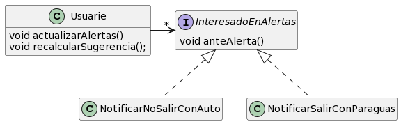
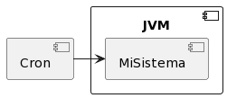
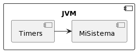

QMP6: cierre
============

> Como usuarie de QuéMePongo quiero que se actualice mi sugerencia diaria con las condiciones climáticas actualizadas cuando se genere algún alerta durante el día

Habíamos llegado hasta acá. Habíamos llegado a una solución "hardcodeada": cuando alguien disparaba el proceso de consulta de alertas, internamente el servicio meteorológico o el propio usuario, si había alertas nuevas, disparaba el la generación de sugerencia diaria. Algo así:

```java
class RepositorioAlertas {

  void actualizarAlertas() {  // después veremos si esto va acá
    this.borrarTodas();
    RepositorioUsuarios
      .instancia
      .todos()
      .each { usuarie -> this.agregarTodas(usuarie.obtenerAlertas())  }
  }
}

class Usuario {
  List obtenerAlertas() {
    var alertas = servicioMeteorologico.obtenerAlertas(this.ciudad);
    if (!alertas.empty()) {
      this.recalcularSugerencias(...);
    }
    return alertas
  }
}

class ServicioMeteorologicoAccuWeather {
  List obtenerAlertas(Ciudad ciudad) {
    return obtenerAlertasUltimaHora(ciudad);
  }
}
```

A algunas personas les podía molestar (con razón) la mezcla de los _patrones de comunicación_, entonces podemos cambiar ligeramente la semántica:

```java
class RepositorioUsuarios {

  void actualizarAlertas() { // idem, luego vemos si queda acá
      RepositorioAlertas.borrarTodas();
      this.todos().each { it -> it.actualizarAlertas()  };
  }
}

class Usuario {
  void actualizarAlertas() {
    var alertas = servicioMeteorologico.obtenerAlertas(this.ciudad);
    if (!alertas.empty()) {
      this.recalcularSugerencias(...);
    }
    RepositorioAlertas.agregarTodas(alertas);
  }
}

class ServicioMeteorologicoAccuWeather {
  void obtenerAlertas(Ciudad ciudad) {
    return obtenerAlertasUltimaHora(ciudad);
  }
}
```

Pero el problema sigue siendo que todo parece estar bastante acoplado. Ya veremos que hacer.


> Nota: en la solución propuesta de QMP6 la delegación está un poco diferente, porque se asume que hay un único servicio, en lugar de ser por usuario. A fines prácticos, no cambia demasiado.


Veamos los siguientes requerimientos:

> Como usuarie de QueMePongo quiero tener la posibilidad de que ante una alerta de tormenta la app me notifique que debo llevarme también un paraguas
> Como usuarie de QueMePongo quiero que ante una alerta meteorológica de granizo la app  me notifique que evite salir en auto
> Como usuarie de QueMePongo quiero poder recibir un mail avisándome si se generó algún alerta meteorológico y cuál


¡Un montón de cosas! ¿Qué deberíamos hacer? ¿Algo así?


```java
class Usuario {
  void actualizarAlertas() {
    var alertas = servicioMeteorologico.obtenerAlertas(this.ciudad);
    if (!alertas.empty()) {
      this.recalcularSugerencias(...);

      if (...hay tormeta entre las alertas..) {
        this.notificarParaguas()
      }

      if (...hay granizo entre las alertas...) {
        this.notificarNoSalirEnAuto()
      }


      this.enviarAlertasPorCorreo(alertas)
    }
  }
}
```

Problemas:

* baja cohesión
* difícil de probar (testear)
* difícil de extender (extensibilidad)
* code smells: long method


🤔 ¡Que problema! Esto nos quedaría poco cohesivo. Además tenemos:


> Como usuarie de QuéMePongo quiero poder configurar cuáles de estas acciones (notificaciones, mail, recálculo) quiero que se ejecuten y cuáles no, además de soportar nuevas acciones a futuro. (No nos interesará, sin embargo, soportar nuevas alertas)


```java
class Usuario {
  void actualizarAlertas() {
    var alertas = servicioMeteorologico.obtenerAlertas(this.ciudad);
    if (!alertas.empty()) {
      this.recalcularSugerencias(...);

      if (hayQueNotificarParaguas && ...hay tormeta entre las alertas..) {
        this.notificarParaguas()
      }

      if (hayQueNotificarAuto &&  ...hay granizo entre las alertas...) {
        this.notificarNoSalirEnAuto()
      }

      // etc HORROR
      this.enviarAlertasPorCorreo(alertas)
    }
  }
}
```


```java
class Usuarie {
   private List<InteresadoEnAlertas> interesados;

   void actualizarAlertas() {
     // ...codigo de obtener alertar...
     interesados.each { it -> it.anteAlerta(alertas)  }
   }

   void agregarIteresadoEnAlertas(InteresadoEnAlertas accion) { // addALGOListener en spanglish
     // ...agregar a la lista ...
   }
}

interface InteresadoEnAlertas {
  void anteAlerta(List alertas, Usuarie usuarie);
}

class RecalcularSugerenciaCuandoHayUnaAlerta implements InteresadoEnAlertas {
  void anteAlerta(List alertas, Usuarie usuarie) { // ¿missplaced method?
    usuarie.recalcularSugerencias(alertas);
  }
}

// ¿ Cuando tiene sentido poner un método en un lugar? Cuando ese método aprovecha/usa/necesaria el:
//
// - estado
// - comportamiento
// - polimorfismo <----- bingo. NO estamos ante un missplaced method.

class NotificarNoSalirConAuto implements InteresadoEnAlertas {

  void anteAlerta(List alertas, Usuarie usuarie) { // onAlerta en spansligh
    // notificador.notificar() // NO!!!!   NO ES SOLO UNA ACCION

    // ES todo esto:
    if (...entre las alertas esta la de GRANIZO...) { // cuando
      notificadorPorEmail // como
              .notificarA(
                usuarie.getEmail(), // a quien
                "HAY GRANIZO: RAJA"); // que notificar
    }
  }

}

class NotificarSalirConParaguas implements InteresadoEnAlertas {
   // ...
}
```


En la estructura del patrón observer, no modelamos simplemente acciones, sino la combinación de que ante algo, ocurre otra cosa. Y a eso se lo llama:

  * Interesados
  * Observadores (observers)
  * Oyentes (listeners)
  * Suscriptor


Ventajas:

 * mas cohesivo
 * más flexible (agregar-quitar)
 * más extensible (podemos incorporar nuevos observadores)

Desvantaja:

 * es más compleja

Algunas cosas más:

  * importante: al objeto observable NO le importa qué es lo que hacen los observadores
  * importante: puede haber más de un evento a escuchar. En este ejemplo tenemos uno solo: anteAlerta, pero podria haber más eventos, y por tanto, métodos en la interfaz observadora.
  * también podemos tener múltiples observadores
  * ojo: cuando implementamos observers pueden pasar cosas "complicadas": los observadores podrían interferir entre sí -> apunte sobre los efectos en el observer.


## Diagrama de clases "final":



//www.plantuml.com/plantuml/png/ZT1FIiL030Rm_PmYlDLxWYSGX28kt1IXU83FQLe3ywSaCuAATtTAdOqeEAiXN_8Zn0UOqPDLg31zEABNB3F1bueWxz0Xi1RO-T8ZPO_WQu1ETMNbv0NdoutxTEr9AgmBFDF3_cF3dE_Jjx7ptM_fKMtmFddiCUOYYtZec2S4qRkSXbeoITm2Hqx5_d2RyPFem2CKQuNz3-cNkBwbqzNfjqRdNcHcuhYLDueSdrdj2m00


# Planificación Interna vs Externa

> Como administradore de QueMePongo, quiero que las sugerencias diarias se calculen automáticamente sin que un empleado necesite disparar esta acción manualmente

> Como administradore de QueMePongo, quiero que las alertas se publiquen en el sitio automáticamente sin que un empleado necesite disparar esta acción manualmente


## Planificación Externa


<!-- //www.plantuml.com/plantuml/png/uqhEpot8pqlDAr7m2lDLgEPIK5102Fbc1cSMbwJc9dBLSY6fT2xApmCg1Gc2cRfsI2e1 -->

Las tareas programadas (o _tareas calendarizadas_) operaciones del sistema que en lugar de buscar ejecutarlos de forma interactiva, como parte de nuestros casos de uso, sino de forma automática, con cierta frecuencia.

Planificación externa (por ejemplo, crons en unix):

  * El proceso que planifica y ejecuta es independiente del proceso en el que se realiza la tarea en sí
  * Quien planifica es el proceso externo, típicamente vinculado al sistema operativo
  * Por tanto, es un sistema menos falible (no depende de que haya un proceso siempre funcionando)
  * Sirve para cualquier tecnología/lenguaje
  * Tiene poca resolución: las planificaciones van desde los minutos
  * Hay que configurar la planificación en cada máquina en la que se vaya a ejecutar (en principio)

Planificación interna (por ejemplo, timers en java):

  * El proceso que planifica y ejecuta es el mismo que aquel que realiza la tarea programada
  * Quien planifica es la tecnología en la que desarrollamos
  * Es más falible: si se cae el proceso que realiza la tarea, se cae también el planificador
  * Depende de cada lenguaje de programación/tecnología
  * Tenemos más resolución: podemos realizar planificaciones de milisegundos en adelante
  * No hay que configurarlo en cada ocasión


###  Puntos de entrada

Vamos a necesitar definir un archivo que oficie de punto de entrada, o como se suele llamar en inglés, _main_. Este archivo será responsable de cargar nuestro código y ejecutar la tarea calendarizada.

Recordemos que el IDE/maven convierte nuestros archivos .java en .class. Pero esto en general no nos es suficiente. Necestiamos un empaquetado: el .jar.  (bundle, assembly, package)


```java
package ar.edu.utn.frba.dds.qmp6;

public class Main {
  public static void main(String[] args) {
    System.out.println("Acá ejecutamos nuestras tareas");
  }
}
```

Luego hay que compilarlo, como siempre, pero además empaquetarlo, mediante el assembly plugin. Acá hay un ejemplo de configuración: https://github.com/flbulgarelli/qmp6/blob/d233d7303e396cf2e885e40fca1c3b6964b7ce27/pom.xml#L30-L52. En resumen:

 1. Hacemos un archivo java con un `public static void main()`
 2. Configuramos al plugin de assembly en maven para que tome esa clase
 3. Empaquetamos usando `mvn package`
 4. Configurar contrab:

```
# m h  dom mon dow   command
  * *  *   *   *     java -jar /home/user/tmp/qmp6/target/qmp6-jar-with-dependencies.jar  >> /home/user/tmp/qmp6/ejemplo.log
```

### Paréntesis: crontab

```bash
# Con este comando podemos listar las tareas instaladas
crontab -l
```

```bash
# nos permitirá editar las tareas
crontab -e
```

### Paréntesis: expresiones cron

Ahora sí, expresiones cron. Tienen la siguiente forma:

```bash
# m h  dom mon dow   command
```

Por ejemplo:

```bash
# a cada minuto de cada día
* *  *   *   *     java -jar /home/user/jar-with-dependencies.jar >> /home/user/tarea.log
```

```bash
# cada 5 minutos
*/5 *  *   *   *     java -jar /home/user/jar-with-dependencies.jar >> /home/user/tarea.log
```


```bash
# al inicio de cada hora
0 *  *   *   *     java -jar /home/user/jar-with-dependencies.jar >> /home/user/tarea.log
```

```bash
# a las 23:59 de cada domingo
23 59  *   *   0     java -jar /home/user/jar-with-dependencies.jar >> /home/user/tarea.log
```

¡Tenemos que tener cuidado! Las rutas a los archivos deben ser absolutas.


Si todo está bien, obtendremos el siguiente mensaje al guardar:

```
crontab: installing new crontab
```

### Otro paréntesis más: archivos de log

Necesitamos tener registro de lo que pasó. Redirecciones: > vs >>. tail -F

```bash
* *  *   *   *     java -jar /home/user/jar-with-dependencies.jar >> /home/user/tarea.log
```

### Consideraciones adicionales

 * ¿Cuántos mains tiene que haber? Tantos como "tipos" de tareas programadas haya. En otras palabras, si tenemos una tarea que se ejecuta cada 1 día y otra que se ejecuta cada 1 hora, vamos a necesitar, de mínima, dos mains diferentes. En este QMP6 tenemos, de hecho, dos. Pero la frecuencia no es lo único que nos hace separar entre múltiples mains; podríamos separarlos porque semánticamente los consideramos tareas diferentes.
 * Cada vez que se ejecuta una tarea programada, estamos creando un proceso de la JVM nuevo, y cuando termina, muere. Ojo, que si queremos que nuestros objetos sean persistentes, vamos a necesitar tener algún tipo de almanceamiento durable (base de datos).
 * Nuestro main tiene que poder ejecutarse con muy poco contexto (no asumir que está parametrizado). Esto es fundamental en un **punto de entrada**
 * Cada uno de estos mains tiene tener acceso a todos los objetos con los que va a trabajar. Ergo, es muy común que tengamos que usar repositorios dentro del main. Ejemplo:

```java
import ar.edu.utn.frba.dds.qmp6.RepositorioAlertas;
import ar.edu.utn.frba.dds.qmp6.RepositorioUsuario;

class MainDeActualizarAlertas {

  /**
   * Notar que esto antes estaba en el repo de usuarios y ahora lo movimos acá
   * Noten también que no es necesario (y no es deseable) escribir demsiado código acá,
   * podemos seguir instanciando objetos y delegando usando todo lo que sabemos. ¡Vale diseñar!
   *
   * Este método va a existir sólo para ser un punto de entrada a esta tarea programada.
   */
   public static void main(String[] args) { // rara vez vamos a terminar usando estos argumentos
      RepositorioAlertas.instancia.borrarTodas();
      RepositorioUsuarios.instancia.todos().each { usuario -> usuario.actualizarAlertas()  };
   }
}

class RepositorioAlertas {
  void borrarTodas() { ... }
}

class RepositorioUsuarios {
  List<Usuario> todos() { ... }
}
```

## Planificación interna (Timer/Scheduler)



<!-- //www.plantuml.com/plantuml/png/IyxFBSZFIyqhKV0AyrMevb9GK408-MO6PnQNfEOceWg7PEQc5XLprN9nSK6O2hfsI6e1 -->

Brevísimo ejemplo (aunque NO es lo que vamos a usar en la materia, en principio):

```
jshell> import java.util.Timer
jshell> var timer = new Timer()
timer ==> java.util.Timer@3941a79c

jshell> timer.schedule(new TimerTask() { public void run() { System.out.println("hola");  } }, 1000)
(1 segundo después)
jshell> hola
jshell> timer.schedule(new TimerTask() { public void run() { System.out.println("hola");  } }, 100)
(100 milisegundos después)
jshell> hola
```
